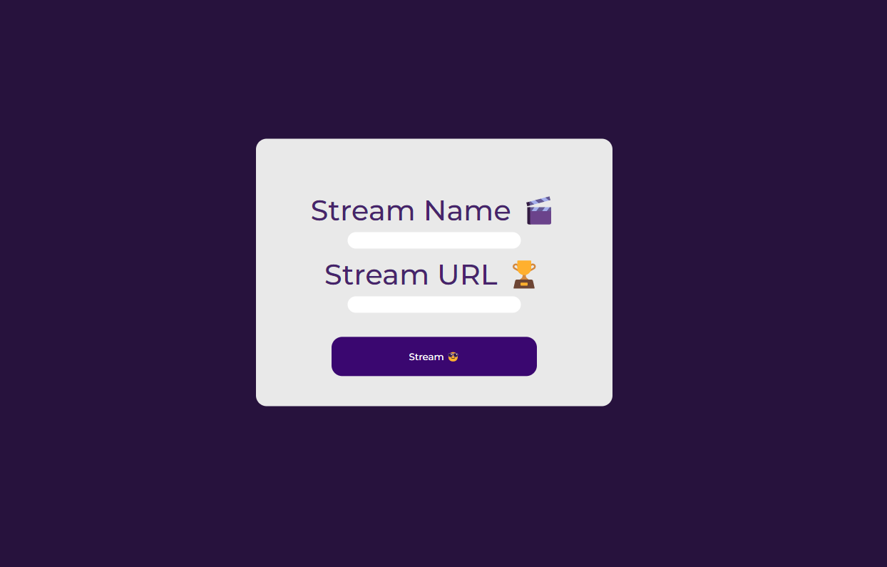

     
    <h1>
        A simple Discord RPC Client Exemple with a Website panel 🍿
    </h1>
    <strong>by pierro</strong>

# What is this ? 
DiscordStatus is a Discord RPC Client with a webserver made with Flask and SocketIO. It makes your profile looks better with a nice streaming status
 

# How to test it? 
* Create a discord application at `https://discord.com/developers/docs/intro`
* Copy your application ID
* Paste it in application_id
* Start app.py *(which is the Flask/Web server)*
* Start bot.py
* Go to http://127.0.0.1:5000 
* And you're done!
# Can I get banned for this?
No, this program isn't using a Selfbot at all. You can't get banned for this 😉

# Please, contribute! 
I'm not a web developer so don't hesitate to help with the HTML & CSS part! 